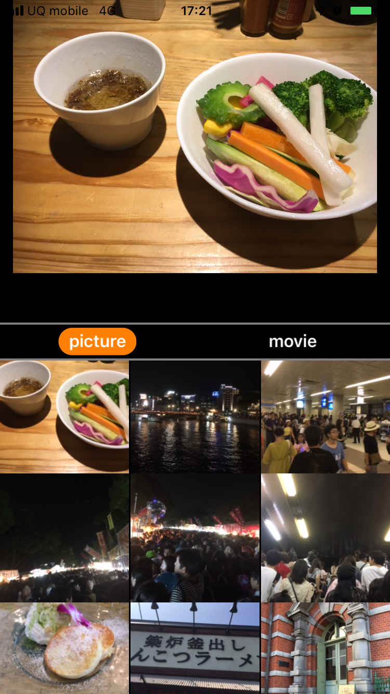
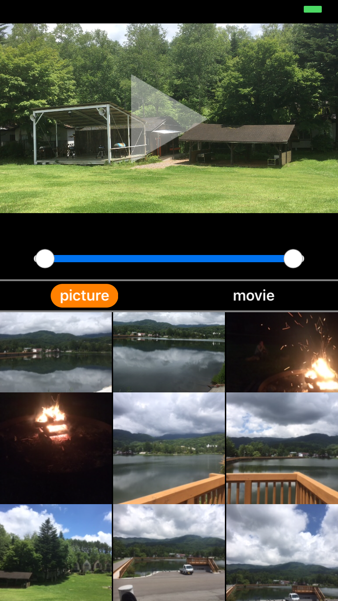

# Photo album Content Selector

This is a simple Application for selecting pictures or videos.

## Features
- Users can select image or movie and view them on the top view.
- Users can also control video play range.

## Requirements

WARangeSlider

## License

MIT

## Links

- https://qiita.com/nnsnodnb/items/6b149a73645206a5600f
- https://superhahnah.com/swift-range-slider/
- http://io-enjoy.info/【swift】avplayerの使い方/

